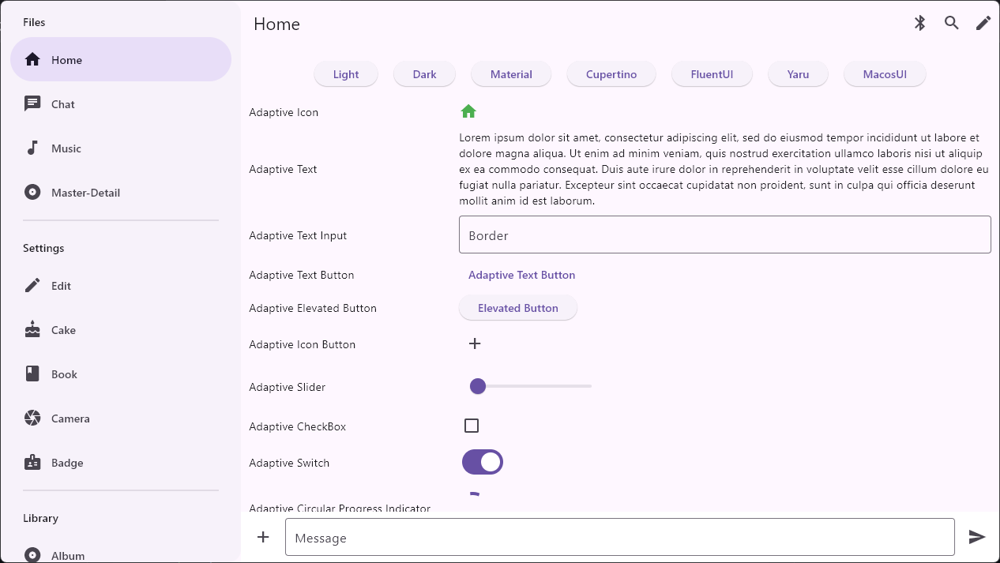
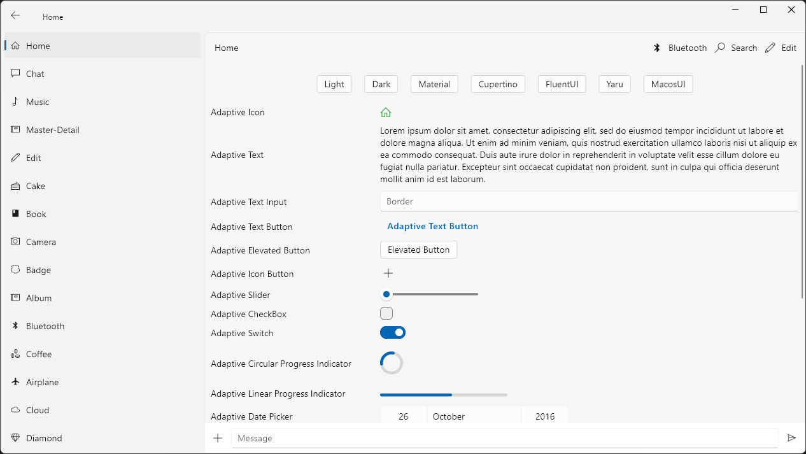

## Flutter Adaptive Core
This library has adaptive widgets and other components that provides native user interface for platforms in apps.

|  |    |  |

### Docs

View the [wiki pages](https://github.com/payhas/flutter_adaptive/wiki) for more information about this library.